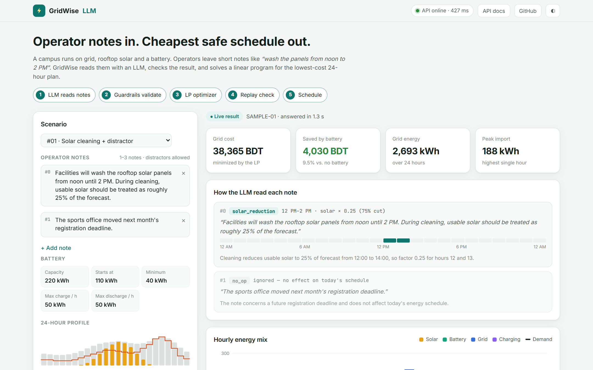
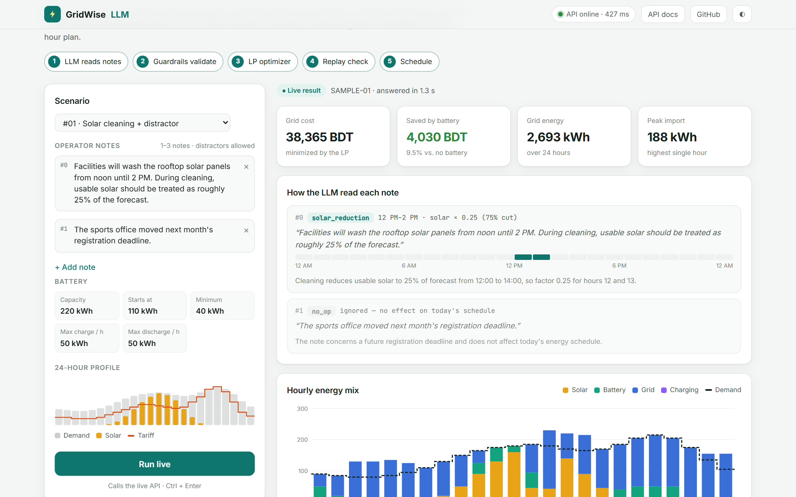
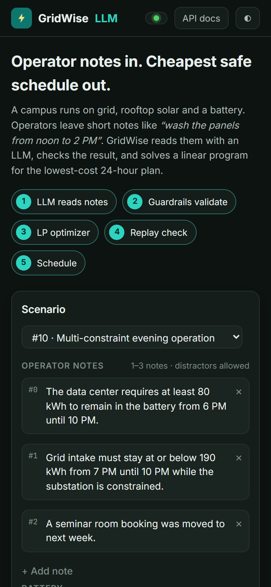
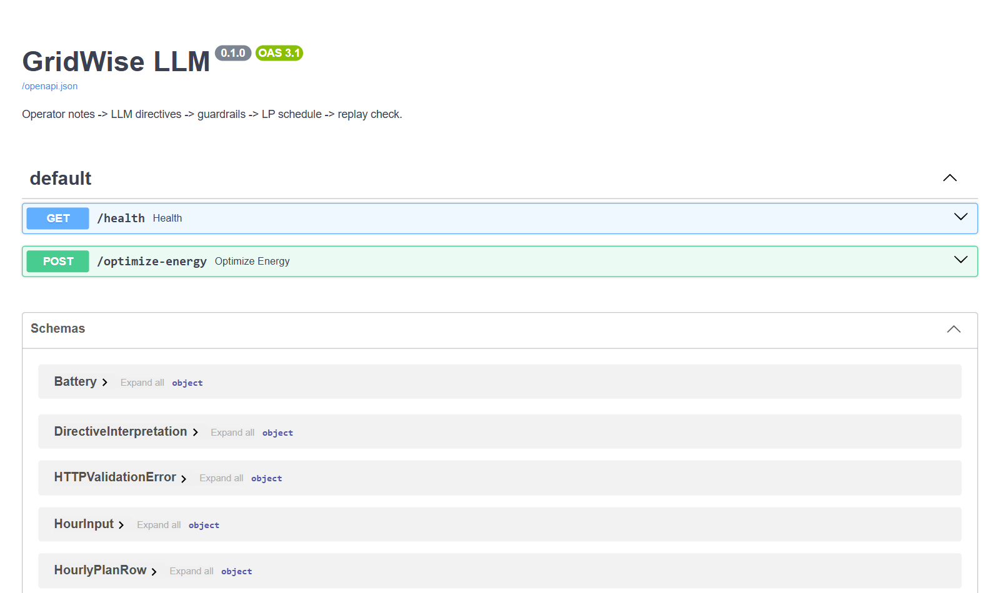

# GridWise LLM

**Plain-English operator notes in → cheapest safe 24-hour energy schedule out.**

A campus gets power from the **grid**, **rooftop solar** and a **battery**. Operators leave short notes such as *"wash the panels from noon to 2 PM"* or *"keep 90 kWh in the battery this evening"*. GridWise turns each note into a structured rule with an LLM, validates it, and solves a linear program for the lowest-cost hourly plan.

Built for **BUP CSE Fest 2026** (Hackathon, Phase 1 · BUP Computer Programming Club with Poridhi).

## 🔗 Live links

| What | URL |
|---|---|
| **Web app (try it)** | **https://gridwise-llm-app.vercel.app** |
| API | https://gridwise-llm-api.vercel.app |
| Swagger docs | https://gridwise-llm-api.vercel.app/docs |
| Health check | https://gridwise-llm-api.vercel.app/health |

Results show as soon as the page opens. Each public sample comes with a saved result that this API produced, so you don't wait for anything. Press **Run live** (or `Ctrl + Enter`) to send the scenario to the real API. You can also edit the notes and write your own. A live run takes about 1–2 seconds.



<details>
<summary>More screenshots: charts, mobile/dark, Swagger</summary>







</details>

---

## How it works

```
operator notes ──► 1. LLM ──► 2. Guardrails ──► 3. LP optimizer ──► 4. Replay check ──► JSON schedule
                  (Groq)     (validate JSON)    (PuLP + HiGHS)      (re-verify rules)
```

| Step | File | What it does |
|---|---|---|
| 1. LLM interpreter | [`llm_interpreter.py`](backend/app/llm_interpreter.py) | Sends only the notes and the battery capacity to the LLM. It never sees demand, solar or tariff data. The LLM returns one directive per note. Providers are tried in order: Groq `gpt-oss-120b` → Groq `gpt-oss-20b` → OpenRouter → Gemini. |
| 2. Guardrails | [`guardrails.py`](backend/app/guardrails.py) | Checks type, hours 0–23 and value ranges. If anything is invalid, that note becomes a safe `no_op`. |
| 3. Optimizer | [`optimizer.py`](backend/app/optimizer.py) | Linear program that minimizes `Σ grid_kwh × tariff`. It respects energy balance, battery limits, end-of-day battery = start, and every directive. |
| 4. Replay | [`replay.py`](backend/app/replay.py) | Re-checks the finished plan hour by hour, the same way a judge would. Totals are recomputed from the plan. |
| API | [`main.py`](backend/app/main.py) | `GET /health` and `POST /optimize-energy`. |

### Directive types

| Type | Meaning | `structured_adjustment` |
|---|---|---|
| `solar_reduction` | Less usable solar | `{"hours": [...], "factor": 0.25}`, where `factor` is the fraction **remaining** |
| `minimum_battery_reserve` | Battery must stay ≥ X kWh | `{"hours": [...], "minimum_energy_kwh": 90}` |
| `no_charge_window` | Battery may not charge | `{"hours": [...]}` |
| `no_discharge_window` | Battery may not discharge | `{"hours": [...]}` |
| `max_grid_window` | Grid import is capped | `{"hours": [...], "max_grid_kwh": 180}` |
| `no_op` | Distractor with no effect | `null` |

Hours are start-inclusive and end-exclusive: "1 PM to 3 PM" → `[13, 14]`.

If the notes ask for something impossible (for example, a grid cap below what the battery can cover), the API returns **422** with a clear message. It does not return a schedule that breaks the rules.

---

## Project structure

```
backend/            FastAPI service (deployed to Vercel as gridwise-llm-api)
  app/              main, llm_interpreter, guardrails, optimizer, replay, schemas, config
  tests/            pytest: health, guardrails, optimizer vs. public samples, API contract
  requirements.txt
  Dockerfile        Docker fallback for any container host
  sample.json       one request body for quick curl tests
frontend/           Static web app with no build step (deployed to Vercel as gridwise-llm)
  index.html  styles.css  app.js
  samples.json      10 public samples + saved API responses (instant first view)
docs/
  challenge/        problem statement, rubric, rulebook, public sample cases
  screenshots/
```

## Run locally

**Backend** (Python 3.11+):

```bash
cd backend
pip install -r requirements.txt
cp .env.example .env          # Windows: copy .env.example .env, then set GROQ_API_KEY
uvicorn app.main:app --reload --port 8000
```

Get a free Groq key at https://console.groq.com/keys. Without any key, every note becomes `no_op`, but the API still returns a valid schedule.

```bash
curl http://127.0.0.1:8000/health
curl -X POST http://127.0.0.1:8000/optimize-energy -H "Content-Type: application/json" -d @sample.json
```

**Frontend.** Any static server works. Open on `localhost`, the app calls `http://127.0.0.1:8000` automatically:

```bash
cd frontend
python -m http.server 5500
```

Then open http://localhost:5500. To point the app at any other API, use `?api=https://your-api`.

**Tests:**

```bash
cd backend
python -m pytest -q -p no:warnings
```

## Deploy

Both parts are on **Vercel**. The backend uses Vercel's zero-config FastAPI support, which detects `app/main.py`. Cold starts take about 1–2 s, compared with 30–60 s on a sleeping free Render instance.

```bash
cd backend  && vercel env add GROQ_API_KEY production && vercel deploy --prod
cd frontend && vercel deploy --prod
```

The solver is **HiGHS** (`highspy`). It runs in-process, so serverless needs no solver binary.

**Docker fallback** (Render, Railway, Fly, or your own machine):

```bash
cd backend
docker build -t gridwise-llm .
docker run --rm -p 8000:8000 -e GROQ_API_KEY=your_key gridwise-llm
```

---

## The challenge (BUP CSE Fest 2026)

`POST /optimize-energy` receives one scenario with `scenario_id`, 1–3 `operator_notes`, 24 `hours` of demand/solar/tariff, and the `battery` limits. It must respond within 30 s with the LLM interpretation, an `hourly_plan` and totals. Scoring is automated (100 pts): LLM interpretation 25, directive application 25, optimization quality 10, API contract 10, performance 10, deployment 10, documentation 10.

All 10 public samples match the reference interpretation and the reference optimal cost.

| Document | |
|---|---|
| [Problem Statement](docs/challenge/Problem_Statement.pdf) | Scenario, directives, schemas, energy rules |
| [Participant Guide & Rubric](docs/challenge/Participant_Guide_and_Rubric.pdf) | Deployment, scoring, penalties |
| [Public Sample Cases](docs/challenge/public_sample_cases.json) | 10 worked examples |
| [Hackathon Rulebook](docs/challenge/Hackathon_Rulebook.pdf) | Event-wide rules |

**Limits.** The free Groq tier allows about 8K tokens per minute per model, which is roughly 9 live runs a minute. When the primary model is busy, the second Groq model takes over. Never commit a filled `.env`.
