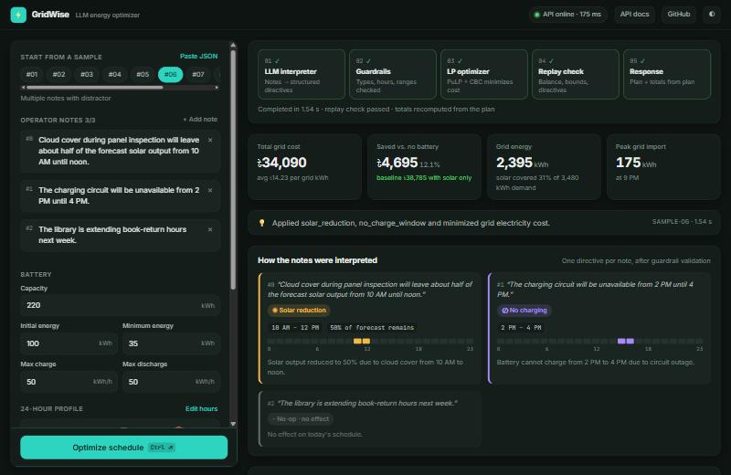
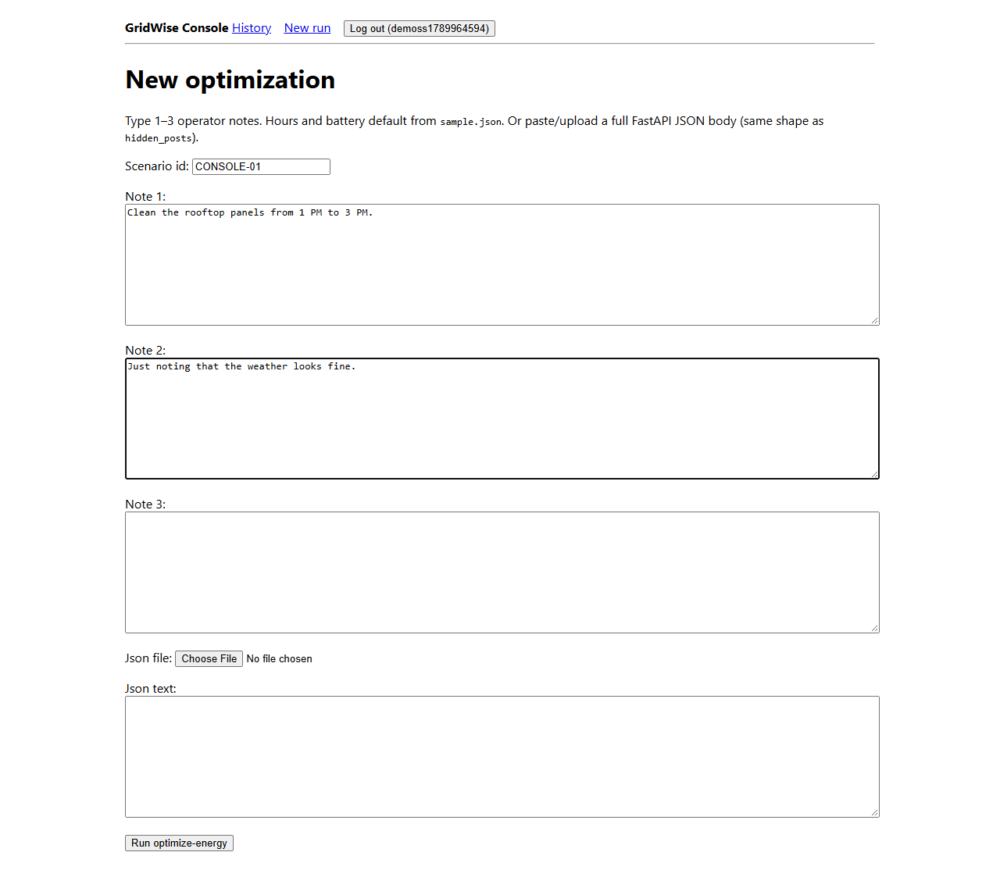
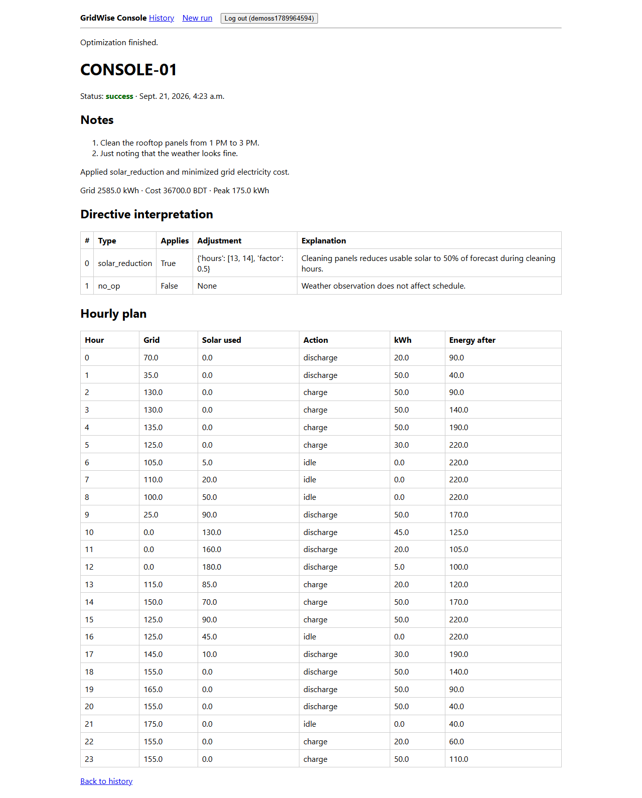

# GridWise LLM — BUP CSE Fest 2026

Energy-optimization API for the **BUP CSE Fest 2026** hackathon (BUP Computer Programming Club, Dept. of CSE, Bangladesh University of Professionals, in association with Poridhi).

Phase 1 (online) is this GridWise API. Phase 2 was a separate on-site problem.

## Problem it solves

Campus power comes from the **grid**, **rooftop solar**, and a **battery** over 24 hours (`0`–`23`). Operators send **1–3 natural-language notes** (some are distractors). This API turns notes into structured directives, validates them, solves a linear program for the schedule, replays it, and **minimizes grid electricity cost**.

```
Energy Data + Operator Notes → LLM Interpreter → Guardrail Validator → Math Optimizer → Replay Validator → API Response
```

## Tech stack

| Piece | Choice |
|---|---|
| API | **FastAPI** + Pydantic (`GET /health`, `POST /optimize-energy` only) |
| LLM | Notes-only prompt; Free-AI Gateway, then **Groq**, then OpenRouter, then Gemini |
| Guardrails | [`app/guardrails.py`](app/guardrails.py) — typed JSON, hour ranges, `no_op` |
| Optimizer | **PuLP + CBC** ([`app/optimizer.py`](app/optimizer.py)) |
| Replay | [`app/replay.py`](app/replay.py) |
| Web console | Single-page UI served by FastAPI at `/` ([`app/static/index.html`](app/static/index.html)) — no build step |
| Django console | **Django** + PostgreSQL/SQLite ([`web/`](web/README.md)) — does not change judge routes |
| Deploy | **Docker** on **Render** |

### 🔗 Live links

| What | URL |
|---|---|
| **Interactive console (try it)** | **https://gridwise-llm-fastapi.onrender.com/** |
| API base | https://gridwise-llm-fastapi.onrender.com |
| Swagger docs | https://gridwise-llm-fastapi.onrender.com/docs |
| Health | https://gridwise-llm-fastapi.onrender.com/health |

The free Render instance can sleep. The first request after idle may take about 30–60 seconds; the console shows a "waking server" status while it starts.

### Web console

Open the live link above (or http://127.0.0.1:8000/ locally) to use the API without writing JSON:

- **Scenario builder:** load any of the 10 public samples in one click, edit 1–3 operator notes (with quick-insert examples), battery limits, and the 24-hour demand/solar/tariff profile. You can also paste a full request JSON.
- **Pipeline view:** follows the request through LLM interpreter → guardrails → LP optimizer → replay check → response, with live health status and validation errors mapped to the step that rejected them.
- **Directive cards:** each note shows how the LLM read it: directive type, parameters, the affected hours on a 24-hour strip, and the explanation (including guardrail downgrades to `no_op`).
- **Results:** total cost, savings against a solar-only/no-battery baseline, grid energy and peak import; an hourly energy-mix chart (solar, battery, grid, charging vs. demand) and a battery state-of-charge vs. tariff chart, both with hover details; the full hourly plan table.
- **Raw exchange:** response JSON, request JSON, and a ready-to-run cURL command with copy and download.
- Light/dark theme, mobile layout, `Ctrl+Enter` to run, recent runs kept in the browser.



The console only calls the existing `GET /health` and `POST /optimize-energy`; the judge contract is unchanged.

```bash
curl https://gridwise-llm-fastapi.onrender.com/health
curl -X POST https://gridwise-llm-fastapi.onrender.com/optimize-energy -H "Content-Type: application/json" -d @sample.json
```

Swagger UI (`/docs`):


---

## The challenge

BUP campus draws power from the **grid**, **rooftop solar**, and a **battery** over 24 hours (`0`–`23`). Each scenario includes demand, solar forecast, and grid tariff per hour, plus **1–3 natural-language operator notes** (some are distractors).

`POST /optimize-energy` must:

1. Use an **LLM** to turn every note into a structured directive (or `no_op`).
2. **Validate** that JSON before trusting it (guardrails).
3. Solve a **linear program** for the 24-hour battery/grid/solar schedule (minimize `sum(grid_kwh * tariff)`).
4. **Replay** the schedule and check energy rules and directives.
5. Return interpretation + plan. Totals are recomputed from `hourly_plan`.

The LLM must produce `directive_interpretation`. Using it only for `plan_summary` is not enough.

### Directive types

| Type | Meaning | `structured_adjustment` |
|---|---|---|
| `solar_reduction` | Usable solar drops in listed hours | `{"hours":[...], "factor": number}` — `factor` is the **fraction remaining** (an 80% cut → `0.2`) |
| `minimum_battery_reserve` | Battery must stay ≥ X kWh in listed hours | `{"hours":[...], "minimum_energy_kwh": number}` |
| `no_charge_window` | Battery may not charge | `{"hours":[...]}` |
| `no_discharge_window` | Battery may not discharge | `{"hours":[...]}` |
| `max_grid_window` | Grid import capped | `{"hours":[...], "max_grid_kwh": number}` |
| `no_op` | Distractor, no schedule effect | `null` |

Hours are **start-inclusive, end-exclusive**: "1 PM to 3 PM" → `[13, 14]`. Hidden notes paraphrase the same six meanings — do not hard-code sample wording.

### API contract

| Endpoint | Requirement |
|---|---|
| `GET /health` | `200` with `{"status": "ok"}` (within 60s of start) |
| `POST /optimize-energy` | One scenario JSON (`scenario_id`, `operator_notes[1..3]`, `hours[24]`, `battery`). Response within **30s**. |

Energy rules (see the problem PDF §§06–11): energy balance, effective solar, battery bounds, end-of-day neutrality. Numeric tolerance **0.01 kWh / 0.01 BDT**.

### Scoring (100 pts, automated)

| # | Category | Points |
|---|---|---|
| 1 | LLM Directive Interpretation | 25 |
| 2 | Directive Application & Constraint Correctness | 25 |
| 3 | Optimization Quality | 10 |
| 4 | API Contract & Schema | 10 |
| 5 | Performance & Reliability | 10 |
| 6 | Deployment & Docker Fallback | 10 |
| 7 | Documentation & Local Reproducibility | 10 |

A 3-minute video is a **tie-breaker only**. Correct interpretation without applying the directive still loses application points. A cheap but invalid schedule scores **zero** optimization on that case.

### Document pack

| Document | Purpose |
|---|---|
| [Problem Statement](BUP_CSE_FEST_2026_Preliminary_Problem_Statement_GridWise_LLM.pdf) | Scenario, directives, schemas, guardrails, energy rules |
| [Participant Guide & Rubric](BUP_CSE_FEST_2026_Participant_Guide_&_Evaluation_Rubric_GridWise_LLM.pdf) | Deployment, scoring, penalties |
| [Public Sample Cases](BUP_CSE_FEST_2026_Preli_Public_Sample_Cases.json) | 10 worked examples — not the hidden judge set |
| [Hackathon Rulebook](CSE_Fest_2026_Hackathon_Rulebook.pdf) | Event-wide rules |

If the Problem Statement and the Guide disagree: **Problem Statement** wins for the challenge; the **Guide** wins for process/scoring.

---

<!-- Stack table moved to “Tech stack” at the top so GitHub shows it first. -->

## How to run the API

```bash
python -m pip install -r requirements.txt
cp .env.example .env
# set GROQ_API_KEY (easiest) and/or OPENROUTER_API_KEY / GEMINI_API_KEY
uvicorn app.main:app --host 0.0.0.0 --port 8000
```

On Windows PowerShell use `copy .env.example .env` instead of `cp`.

```bash
curl http://127.0.0.1:8000/health
curl -X POST http://127.0.0.1:8000/optimize-energy -H "Content-Type: application/json" -d @sample.json
```

Web console: [http://127.0.0.1:8000/](http://127.0.0.1:8000/) · Swagger UI: [http://127.0.0.1:8000/docs](http://127.0.0.1:8000/docs).

```bash
python -m tests.test_health
python -m tests.test_guardrails
python -m tests.test_optimizer
python -m tests.test_public_samples
```

### Docker (API only)

```bash
docker build -t gridwise-llm-fastapi:v1 .
docker run --rm -p 8000:8000 -e GROQ_API_KEY=your_key gridwise-llm-fastapi:v1
```

Secrets are not baked into the image. Env names: `GROQ_API_KEY`, `FREE_AI_GATEWAY_URL`, `OPENROUTER_API_KEY`, `GEMINI_API_KEY`, `LLM_TIMEOUT_SECONDS`, `PORT` (see [`.env.example`](.env.example)).

---

## Django console

Login, submit notes, store runs. Calls this repo’s FastAPI `POST /optimize-energy`. Details: [`web/README.md`](web/README.md).





```powershell
cd web
python -m pip install -r requirements.txt
copy .env.example .env
python manage.py migrate
python manage.py runserver 8001
python manage.py test
```

Open http://127.0.0.1:8001/accounts/register

Full stack from the repo root:

```bash
docker compose up --build
```

API `:8000`, Django `:8001`, Postgres `:5432`.

---

## Known limitations

Without an LLM key, notes become `no_op` and the schedule still returns `200`. Create a Groq key at https://console.groq.com/keys and set `GROQ_API_KEY`. Hidden notes are paraphrases. Equivalent optimal schedules are accepted; hourly actions need not match the public reference byte-for-byte. Never commit a filled `.env`.
